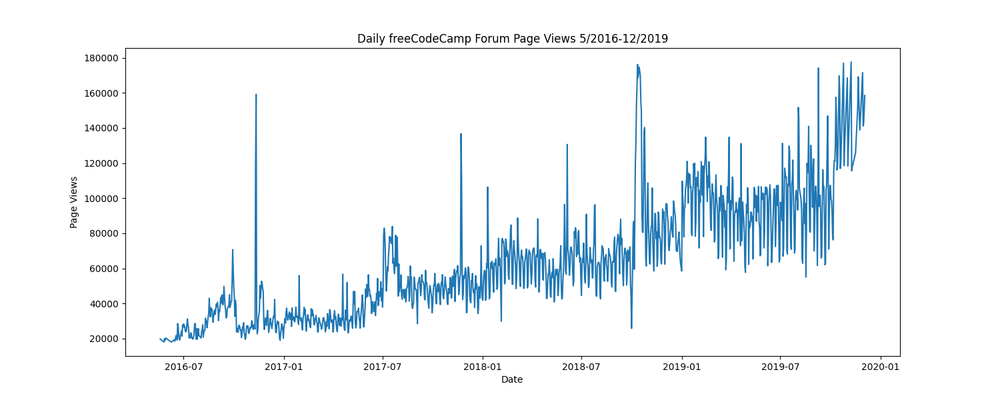
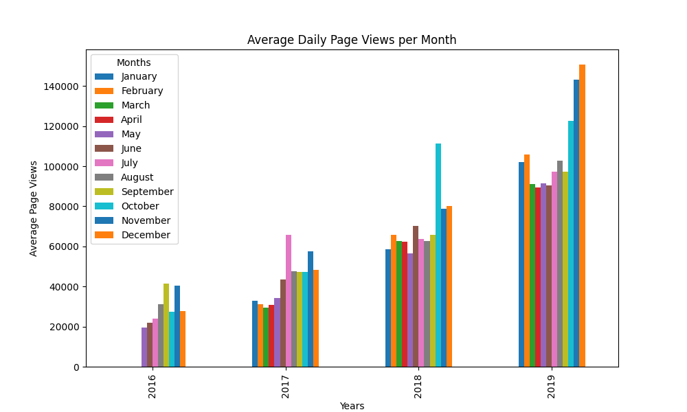

# Time Series Visualizer

In this project, I analyzed the web traffic of Free Code Camp forums from June 2016 to December 2019. I created the following visualizations:

1) Line Plot: Displays daily traffic.

  

2) Bar Plot: Compares each year's average traffic for each month.

3) Box Plot: Shows the year-wise trend and the month-wise seasonality.

