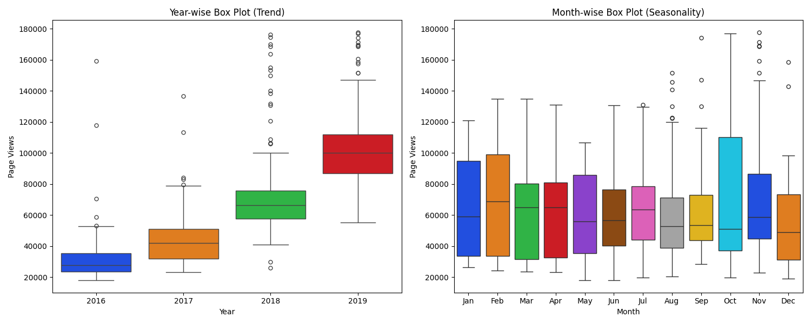

# Time Series Visualizer

In this project, I analyzed the web traffic of Free Code Camp forums from May 2016 to December 2019. Utilizing Python and its libraries —Pandas, Matplotlib, and Seaborn—I created data visualizations to derive meaningful insights and conclusions.

## Line Plot: Daily Page Views.

The line graph indicates a clear upward trend in daily page views for the freeCodeCamp forum from May 2016 to December 2019, with significant spikes and increasing engagement over time.

## Bar Plot: Avarage daily page views per month

The bar chart shows that average daily page views per month have steadily increased from 2016 to 2019, with 2019 having the highest values for each month. Some months, like January and December, show higher engagement, suggesting potential seasonal trends.

## Box Plot: Year-wise trend and Month-wise seasonality.

1) Year-wise Trend:

There is a clear upward trend in page views from 2016 to 2019, with each year showing an increase in median page views.

The range of page views also widens over the years, indicating greater variability in page views in 2019 compared to previous years.

2) Month-wise Seasonality:

Certain months, like October, have higher median page views, indicating increased engagement during those periods.

Other months, such as June and July, have lower median page views, suggesting a seasonal dip in engagement.
